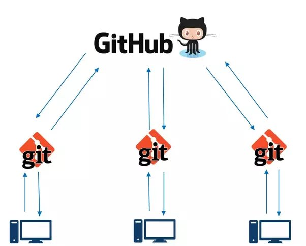
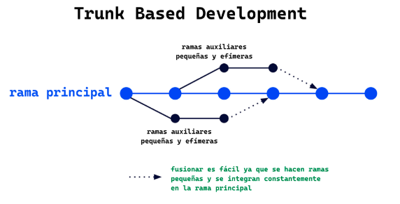
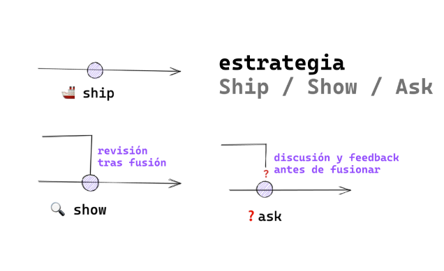

# Clases de git
Estas clases se llevarán acabo durante dos semanas a horas 9pm


## Clase 1
 Git es un sistema distribuido de  control de versiones, donde un control de versiones es un sistema que registra cada cambio que se realiza en el código a lo largo de un proyecto.(un Historico)

  

### Primeros comandos de git
*Para iniciar un nuevo repositorio en git utilizamos:

```bash
          git init
```
*Este comando se utiliza para agregar cambios en un archivo específico al área de preparación (staging area) en Git:

```bash
         git add nombreArchivo
```

 *Este comando se utiliza para guardar los cambios confirmados en el repositorio:
```bash
         git commit -m "titulo del archivo"
```

*Este comando muestra el estado actual del repositorio Git:
```bash
         git status
```

*Para volver a un commit anterior usamos:
```bash
        git checkout <hash_del_commit_anterior>
        git reset --hard <hash_del_commit_anterior>
```           

*Para revisar historial o identificar cambios utilizamos:
```bash
         git log
```
### Importante:

**Head significa que estas aqui, puntero para saber donde estamos**

## Clase 2
Al usar Git, los archivos pueden tener alguno de los siguientes estados:

• modificado (modified)

• preparado (staged)

• confirmado (committed)


La rama es un snapshot de la división del estado del código, un nuevo apuntador(bifurcación)

### ¿Para que sirve?
permite realizar un desarrollo no lineal y colaborativo


*Para listar las ramas:
```bash
         git branch
```
*Para crear una rama(especificar lo que hará):
```bash
         git  branch "nombre de la rama"
```
*Para cambiar entre ramas:
```bash
         git switch "nombre de la rama"
         
         git checkout "nombre de la rama" (no recomendado)
```

*Para cambiar y crear una rama:
```bash

         git checkout -b "nombre de la rama"

        git switch -c "nombre de la rama"
      
```
### Fusionar ramas

Integración de dos ramas, incorporar los cambios de una rama a la rama donde estoy.

```bash

         git merge "nombre de la rama"
 ```
 *Para cancelar el merge
 ```bash

         git merge --abort
 ```
*Para eliminar una rama(limpiar el espacio de trabajo):
```bash

         git branch -d "nombre de la rama"
 ```
*Ver todas las ramas:
```bash

         git  branch -a
 ```

*Ver historial de otras maneras:
```bash

         git log --oneline

         git log --graph
 ```
 
### Conflictos

Cambios en la misma linea de código en distintas ramas, donde al fusionar serán distintas


## Clase 3
Git es un control de versiones y GitHub es un servicio de alojamiento en la nube de código fuente.



**Repositorios remotos.-** Están hospedados en un servidor para sincronizarse con otros repositorios.

*Para colocar el gitHub al git:

```bash
     git remote add origin "enlace"
 ```
*Para ver si se hizo:
 ```bash
     git remote-v
 ```
*Para subir a gitHub, para sincronizar los cambios del repo local al repo remoto:
 ```bash
     git push origin master (En vez de master, puede ser otra rama)
 ```
 *Para subir a gitHub, de otra manera(Leer documentación):
 ```bash
     git push -u origin master 
 ```
  *Para clonar repositorios:
 ```bash
     git clone "url" 
 ```
  *Para actualizar las ramas existentes:
 ```bash
     git fetch
 ```
  *Para actualizar las ramas borradas y borrarlas:
 ```bash
     git remote prune origin
 ```

 ## Clase 4
En esta clase se verá git push, git pull, pull request.


#### Git push
Empujar cualquier cambio de la máquina local a la remota
```bash
     git push origin "rama"
 ```
 Tenemos tambien el comando:
 ```bash
     git push -u
 ```
 Tambien tenemos el comando para forzar un push, donde podria ser peligroso porque se podria borrar cambios existentes:
 ```bash
     git push -f
 ```
 #### Git pull
Jalar cualquier cambio del remoto a la máquina local
```bash
     git pull origin main
 ```
#### Pull request
Petición de cambios que se envía a un repositorio, es como mostrar el trabajo para recibir el feedBack adecuado.

## Clase 5
En esta clase se verá gitFlow
#### GitFlow
Flujos de trabajo colaborativo con GIT.


##### Definición del gitFlow

GitFlow es un modelo de flujo de trabajo colaborativo en equipos de desarrollo de software. 

Entre los flujos mas antiguos es main(master),develop 


Ramas de apoyo : feature, release y hotfix.


##### Trunk based development
Ramas efimeras que quieren ser integradas por medio de una pull request.
Es util si contamos con buen sistema CI/CD



##### ship / show / ask

Ship .- se fusiona en la rama principal .

Show.- Abre una peticion de cambios para que sea revisado(fusión inmediato).

Ask.- Abre un PR para discutir los cambios.



## Clase 6
Buenas practicas


#### Escribir buenos commits

Usar verbo imperativo:
Add: añadir nuevo archivo

Change: se modifica un archivo existente

Fix: Se arregla un bug

Remove: se elimina algun archivo

Utilizar como máximo 50 caracteres en un mensaje de commit. Utilizar prefijos para  que el historial se mas legible.


#### Escribir bueno nombre de rama

Podriamos utilizar:

Bug: Cambios de código para arreglar bugs

Feature: Desarrollo de una nueva caracteristica.

Experiment: Cosas experimentales

Hotfix: Cambio rápido de error crítico

utilizar IDs para la gestión del proyecto.


## Clase 7
¿Cómo deshacer cambios?

##### Deshacer el último commit
Si quieres mantener los cambios:
```bash
     git reset --soft HEAD~1
 ```
 Si *NO* quieres mantener los cambios:
```bash
     git reset --hard HEAD~1
 ```

 ##### Arreglar el último commit

 ```bash
     git commit --amend .m "mensaje corregido"
 ```

 